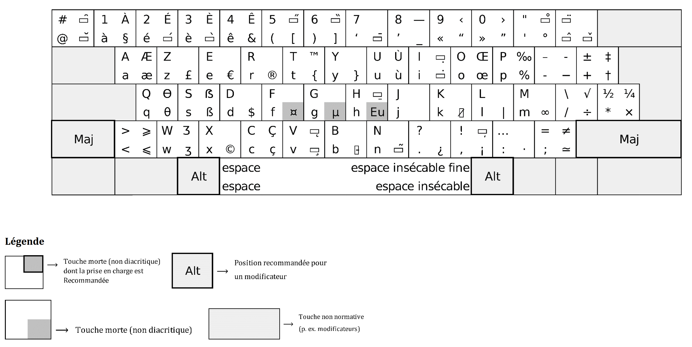

 Veuillez consulter [la documentation en français](https://springcomp.github.io/optimized-azerty-win/). 

## Content

This repository contains a simple .klc file which can be used with [Microsoft Keyboard Layout Creator](https://www.microsoft.com/en-us/download/details.aspx?id=22339)
to add a custom layout on Windows supporting a recently standardized azerty keyboard layout.

## Installation

See the [Releases](https://github.com/springcomp/optimized-azerty-win/releases) tab to download the last setup.

When the keyboard layout is installed, you will certainly have to restart Windows to allow the new layout to be displayed on the language setup screen.

The keyboard is installed as « Français - AZERTY NF Z71-300 » layout.

## Usage

### Overview

The recently standardized AZERTY (hereafter referred to as AZERTY-NF) layout is designed to be very similar to the AZERTY layout in order to minimize disruption to users who write in the French language. Yet, the new layout is superior in many ways:

- It includes *all* the characters that are required to write proper French, including accented upper case letters (for instance, `É`, `œ` and `«`).
- It is designed to be more user-friendly and allow quicker typing.
- It includes almost 60 additional characters used in foreign languages and technical publications.
- Yet, those characters are easy to find thanks to clusters of likewise characters at sensible locations.

### Diacritical marks and accented characters

The most distinctive changes introduced by the AZERTY-NF layout concern typing accented characters.

Similar to the <kbd>^</kbd> you may be familiar with, diacritical marks can be input using one of the dedicated key, followed by the appropriate letter. The diacritical mark key acts as a *dead key*, meaning that it does not generate a complete character by itself but modifies the character generated by the key struck immediately after to produce the desired result.

For instance, typing the letter `Û` is achieved by typing the <kbd>^</kbd>, <kbd>Shift</kbd>+<kbd>U</kbd> combination.

The AZERTY-NF layout differs in subtle ways from the AZERTY layout you have grown accustomed to. Because many European languages use complex diacritical marks, the AZERTY-NF layout is designed to allow typing arbitrary accents on a base letter.

To support this scenario, the present layout allows typing a combining diacritical mark to be applied to the previously typed character. To input a combining diacritical mark, just repeat the dead key associated with the desired mark.

For instance:

- <kbd>AltGr</kbd>+<kbd>v</kbd>, <kbd>AltGr</kbd>+<kbd>v</kbd> produces a combining cedilla `◌̧` (U+0327).

Please, note that using a combining diacritical mark differs from using a dead-key in the following ways:

- The combining diacritical mark must be typed __after__ a previously typed character, whereas a dead key must be typed before the desired character key.
- Using a combining diacritical mark __produces an additional Unicode code point__ in the output, and thus modifies the previously typed character to apply a diacritical mark, whereas the sequence of a dead-key followed by a character produces a single Unicode code point, corresponding to a [precomposed character](https://en.wikipedia.org/wiki/Precomposed_character).

For instance, the following two combinations both produce the letter `é`. However, the resulting sequences of Unicode code points differ:

- <kbd>AltGr</kbd>+<kbd>é</kbd>, <kbd>e</kbd> produces `é` (U+00E9).
- <kbd>e</kbd>, <kbd>AltGr</kbd>+<kbd>é</kbd>, <kbd>AltGr</kbd>+<kbd>é</kbd> produces `é` (U+0065, U+0301) `e + ◌́` .

Please, note that it is possible to input a non-combining version of a diacritical mark by typing a <kbd>Space</kbd> after the dead-key.

This allows to input certain characters verbatim. However, please note that certain diacritical marks do not have a non-combining variant. For these characters, a somewhat equivalent glyph is produced, according to the following table:

|Sequence|Character|Unicode code point|
|---|---|---|
| <kbd>AltGr</kbd>+<kbd>@</kbd>, <kbd>Space</kbd> | `˘` | BREVE (U+02D8) |
| <kbd>AltGr</kbd>+<kbd>#</kbd>, <kbd>Space</kbd> | `°` | DEGREE SIGN (U+00B0)¹ |
| <kbd>AltGr</kbd>+<kbd>é</kbd>, <kbd>Space</kbd> | `´` | ACUTE ACCENT (U+00B4) |
| <kbd>AltGr</kbd>+<kbd>è</kbd>, <kbd>Space</kbd> | `` ` `` | GRAVE ACCENT (U+0060) |
| <kbd>AltGr</kbd>+<kbd>Shift</kbd>+<kbd>(</kbd>, <kbd>Space</kbd> | `˝` | DOUBLE ACUTE ACCENT (U+02DD) |
| <kbd>AltGr</kbd>+<kbd>Shift</kbd>+<kbd>)</kbd>, <kbd>Space</kbd> | `˵` | DOUBLE GRAVE ACCENT (U+02F5)² |
| <kbd>AltGr</kbd>+<kbd>‘</kbd>, <kbd>Space</kbd> | `¯` | MACRON (U+00AF) |
| <kbd>AltGr</kbd>+<kbd>"</kbd>, <kbd>Space</kbd> | `˚` | RING ABOVE (U+02DA) |
| <kbd>^</kbd>, <kbd>Space</kbd> | `^` | CIRCUMFLEX ACCENT (U+005E) |
| <kbd>Shift</kbd>+<kbd>^</kbd>, <kbd>Space</kbd> | `¨` |  DIAERESIS (U+00A8) |
| <kbd>AltGr</kbd>+<kbd>^</kbd>, <kbd>Space</kbd> | `ˇ` | CARON (U+02C7) |
| <kbd>AltGr</kbd>+<kbd>i</kbd>, <kbd>Space</kbd> | `˙` | DOT ABOVE (U+02D9) |
| <kbd>AltGr</kbd>+<kbd>I</kbd>, <kbd>Space</kbd> | `.` | FULL STOP (U+002E)³ |
| <kbd>AltGr</kbd>+<kbd>H</kbd>, <kbd>Space</kbd> | `ˍ` | MACRON BELOW (U+02CD) |
| <kbd>AltGr</kbd>+<kbd>k</kbd>, <kbd>Space</kbd> | `/` | SOLIDUS (U+002F) |
| <kbd>AltGr</kbd>+<kbd>v</kbd>, <kbd>Space</kbd> | `¸` | CEDILLA (U+00B8) |
| <kbd>AltGr</kbd>+<kbd>V</kbd>, <kbd>Space</kbd> | `˛` | OGONEK (U+02DB) |
| <kbd>AltGr</kbd>+<kbd>b</kbd>, <kbd>Space</kbd> | `-` | HYPHEN-MINUS (U+002D) |
| <kbd>AltGr</kbd>+<kbd>n</kbd>, <kbd>Space</kbd> | `~` | TILDE (U+007E) |
| <kbd>AltGr</kbd>+<kbd>!</kbd>, <kbd>Space</kbd> | `,` | COMMA (U+002C)⁴ |

Please, note that this allows typing a `` ` `` (GRAVE ACCENT) character, known to developers as "backtick", even though this character is conspicuously absent from the list of supported characters mandated by the standard.

¹ The 'COMBINING INVERTED BREVE' character does not have a non-combining equivalent and is replaced by the 'DEGREE SIGN' visual approximation.  
² For some reason, the 'DOUBLE GRAVE ACCENT' is positioned at the bottom of the text.  
³ The 'COMBINING DOT BELOW' character does not have a non-combining equivalent and is replaced by the 'FULL STOP' visual approximation.  
⁴ THe 'COMBINING COMMA BELOW' character does not have a non-combining equivalent and is replaced by the 'COMMA' visual approximation.

### Caps Lock

The AZERTY-NF layout also includes the "SGCaps" feature. Used originally for the Swiss-German layout, this feature changes the behaviour of the <kbd>Caps Lock</kbd> key.

Traditionnaly, <kbd>Caps Lock</kbd> acts like maintaining the <kbd>Shift</kbd> key. This means that in a traditionnal AZERTY layout, enabling <kbd>Caps Lock</kbd> and typing <kbd>é</kbd> produces the number `1`.

The AZERTY-NF layout allows you to type the corresponding accented characters when <kbd>Caps Lock</kbd> is toggled on.

Thus, enabling <kbd>Caps Lock</kbd> and typing <kbd>à</kbd>, <kbd>é</kbd>, <kbd>ê</kbd>, <kbd>è</kbd>, <kbd>^</kbd>, <kbd>i</kbd>, <kbd>^</kbd>, <kbd>o</kbd>, <kbd>ù</kbd> produces `ÀÉÊÈÎÔÙ`.

More realistically, enabling <kbd>Caps Lock</kbd> and typing <kbd>c</kbd>, <kbd>'</kbd>, <kbd>e</kbd>, <kbd>s</kbd>, <kbd>t</kbd>, <kbd>Space</kbd>, <kbd>à</kbd>, <kbd>Space</kbd>, <kbd>d</kbd>, <kbd>i</kbd>, <kbd>r</kbd>, <kbd>e</kbd> produces `C'EST À DIRE`. Notice that neither the apostrophe (`'`) nor the accented character (`à`) did require extra precautions. This would not be normally feasible on a traditional AZERTY layout.

### Extended characters

The AZERTY-NF contains a 'European Extended Characters' layer that is accessible after pressing <kbd>AltGr</kbd>+<kbd>Eu</kbd>.

This layer contains characters not in common use in the French language. However, one of the goal of the standard is to allow writing texts with characters most commonly found in other European languages.

The following table shows some characters available from the European Extended Characters layer. Other punctuation marks, not shown here, are also available. Please refer to [the layout](refs/EU_level.png) shown by the official page for more information. 

|Sequence|Character|Unicode code point|
|---|---|---|
| <kbd>AltGr</kbd>+<kbd>Eu</kbd>, <kbd>a</kbd> | `ª` | FEMININE ORDINAL INDICATOR (U+00AA) |
| <kbd>AltGr</kbd>+<kbd>Eu</kbd>, <kbd>d</kbd> | `ð` | LATIN SMALL LETTER ETH (U+0000) |
| <kbd>AltGr</kbd>+<kbd>Eu</kbd>, <kbd>d</kbd> | `Ð` | LATIN CAPITAL LETTER ETH (U+00D0) |
| <kbd>AltGr</kbd>+<kbd>Eu</kbd>, <kbd>e</kbd> | `ə` | LATIN SMALL LETTER SCHWA (U+0259) |
| <kbd>AltGr</kbd>+<kbd>Eu</kbd>, <kbd>e</kbd> | `Ə` | LATIN CAPITAL LETTER SCHWA (U+018F) |
| <kbd>AltGr</kbd>+<kbd>Eu</kbd>, <kbd>g</kbd> | `ŋ` | LATIN SMALL LETTER ENG (U+014B) |
| <kbd>AltGr</kbd>+<kbd>Eu</kbd>, <kbd>g</kbd> | `Ŋ` | LATIN CAPITAL LETTER ENG (U+014A) |
| <kbd>AltGr</kbd>+<kbd>Eu</kbd>, <kbd>i</kbd> | `ı` | LATIN SMALL LETTER DOTLESS I (U+0131) |
| <kbd>AltGr</kbd>+<kbd>Eu</kbd>, <kbd>i</kbd> | `İ` | LATIN CAPITAL LETTER I WITH DOT ABOVE (U+0130) |
| <kbd>AltGr</kbd>+<kbd>Eu</kbd>, <kbd>j</kbd> | `ij` | LATIN SMALL LIGATURE IJ (U+0133) |
| <kbd>AltGr</kbd>+<kbd>Eu</kbd>, <kbd>j</kbd> | `IJ` | LATIN CAPITAL LIGATURE IJ (U+0132) |
| <kbd>AltGr</kbd>+<kbd>Eu</kbd>, <kbd>o</kbd> | `º` | MASCULINE ORDINAL INDICATOR (U+00BA) |
| <kbd>AltGr</kbd>+<kbd>Eu</kbd>, <kbd>s</kbd> | `ſ` | LATIN SMALL LETTER LONG S (U+017F) |
| <kbd>AltGr</kbd>+<kbd>Eu</kbd>, <kbd>t</kbd> | `þ` | LATIN SMALL LETTER THORN (U+00FE) |
| <kbd>AltGr</kbd>+<kbd>Eu</kbd>, <kbd>T</kbd> | `Þ` | LATIN CAPITAL LETTER THORN (U+00DE) |

The `ſ` character, 'LATIN SMALL LONG LETTER S' (U+017F) shown in the table above can also be altered with diacritical marks. 

The following two combinations are available:

- <kbd>AltGr</kbd>+<kbd>k</kbd>, <kbd>AltGr</kbd>+<kbd>Eu</kbd> produces `ẜ` 'LATIN SMALL LETTER LONG S WITH DIAGONAL STROKE' (U+1E9C)
- <kbd>AltGr</kbd>+<kbd>i</kbd>, <kbd>AltGr</kbd>+<kbd>Eu</kbd> produces `ẛ` 'LATIN SMALL LETTER LONG S WITH DOT ABOVE' (U+1E9B)

## Known issues

### Diacritical marks and 'below' variants

The standard mandates that repeating the dead-key associated with a diacritical mark should select the 'BELOW' variant of said diacritical mark.

For instance, typing <kbd>AltGr</kbd>+<kbd>7</kbd> (MACRON) twice should select the `MACRON BELOW` diacritical mark.

Unfortunately, due to the behavior described in the preceding section, this feature is not currently supported in the present layout.

## Links

- [Le nouvel AZERTY](http://norme-azerty.fr/)
- [Annonce AFNOR](https://www.afnor.org/presse_avril2019/clavier-francais-norme-volontaire-pour-faciliter-ecriture/)
- [Norme AFNOR](https://www.boutique.afnor.org/norme/nf-z71-300/interfaces-utilisateurs-dispositions-de-clavier-bureautique-francais/article/901594/fa188960)

Cette œuvre est mise à disposition selon les termes de la [License Creative Commons Attribution 4.0 International](https://creativecommons.org/licenses/by/4.0/).  
