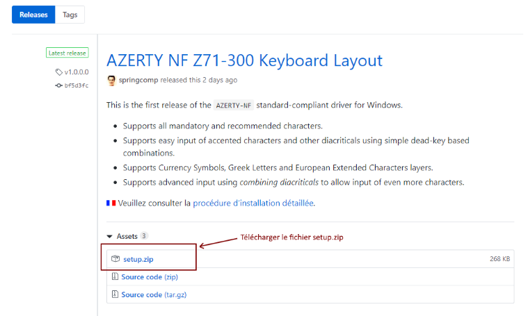
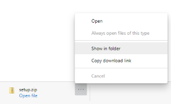
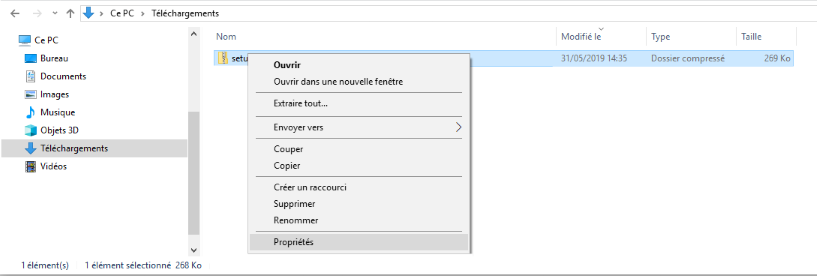
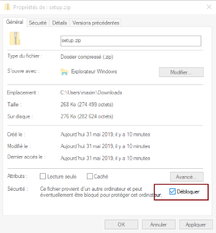
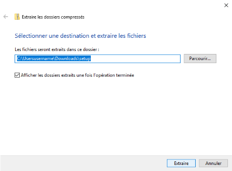
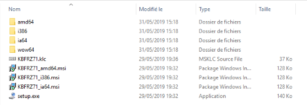
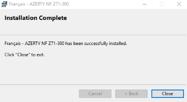
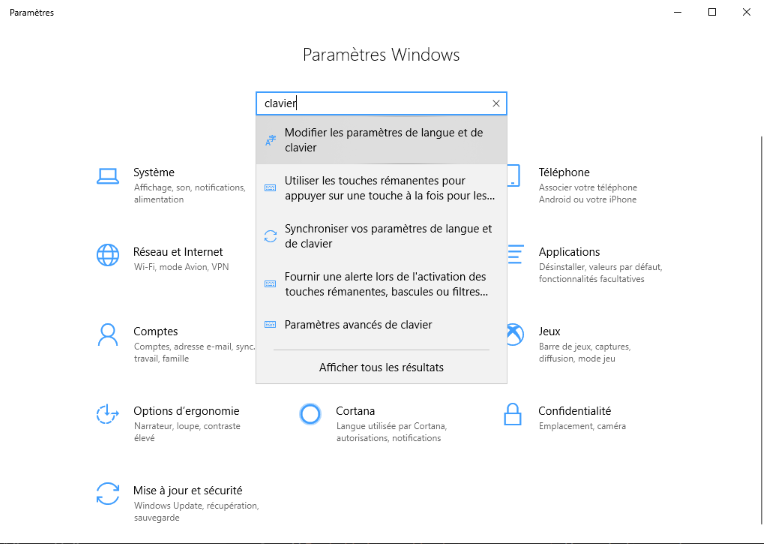
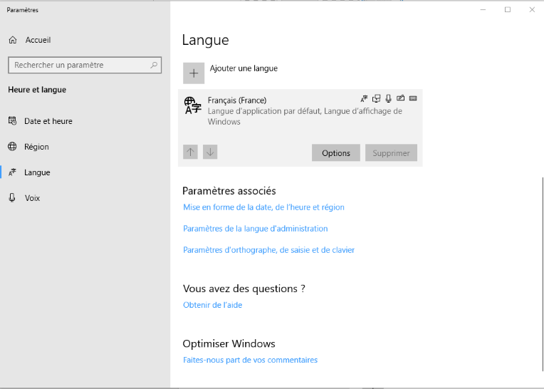
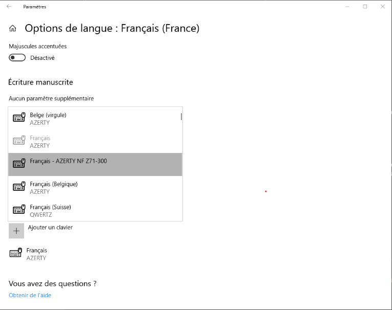

# {{ page.title }}

La disposition de clavier AZERTY-NF doit être installée sous Windows®.  
Cette procédure nécessite les droits d’administration sur la machine.

## TL;DR

- Télécharger et lancer [le programme d’installation](https://github.com/springcomp/optimized-azerty-win/releases) sous Windows®.

Si vous éprouvez des difficultés, veuillez suivre la procédure détaillée ci-dessous.

### Installation avec PowerShell

Vous pouvez installer la disposition directement sous Windows® PowerShell en lançant la séquence de commandes suivante :

Script copié avec succès  

{: .powershell}
    Set-ExecutionPolicy ByPass -Scope Process -Force;
    (New-Object System.Net.WebClient).DownloadFile("https://bit.ly/3KctDMc", "$Env:TEMP\kb.zip")
    Expand-Archive -Path "$Env:TEMP\kb.zip" -Force -DestinationPath "$Env:TEMP\kb"
    . $Env:TEMP\kb\setup.exe

<input class="clipboard" type="button" value="Copy" onclick="copyCodeElementToClipboard('powershell')" />

## Procédure détaillée

La procédure qui suit est volontairement très détaillée.
Néanmoins, si vous éprouvez encore des difficultés, n’hésitez pas à me faire part de vos commentaires pour l’améliorer [en ouvrant un ticket](https://github.com/springcomp/optimized-azerty-win/issues) sur la page du projet.

L’installation est découpée en quatre étapes simples:

- [Téléchargement](#download) de l’archive depuis la page GitHub.
- [Extraction](#extraction) des fichiers d’installation.
- [Installation](#installation) de la disposition proprement dite.
- [Configuration](#configuration) de la disposition dans Windows.

### Téléchargement

Pour télécharger l’archive qui contient le programme d’installation, de votre disque dur, rendez-vous sur la page [Releases](https://github.com/springcomp/optimized-azerty-win/releases) du projet sur GitHub.

### Extraction

L’archive provenant d’Internet, son contenu est, sans doute, protégé par votre navigateur.

Avant de procéder à l’installation proprement dite, il convient de « débloquer » l’archive. Tout d’abord, ouvrez le dossier de téléchargements dans lequel l’archive a été placée par votre navigateur, en cliquant sur le fichier télécharger et en sélectionnant l’option « `Afficher le dossier` » ou (_Show in folder_ en anglais).

Dans le dossier de téléchargement, cliquez avec le bouton droit de la souris sur le fichier `setup.zip`, et sélectionner l’option « `Propriétés` » située en bas dans le menu.

Dans la boîte de dialogue contenant les propriétés du fichier `setup.zip` qui s’affiche, cocher l’option « `Débloquer` » située en bas à droite. Cette option est présente si l’archive a été protégée par votre navigateur au moment du téléchargement.

Une fois l’option cochée, cliquer sur « `Appliquer` », puis sur « `OK` » pour fermer la boîte de dialogue.

Dans le dossier de téléchargement, cliquez avec le bouton droit de la souris sur le fichier `setup.zip` et sélectionner l’option « `Extraire tout...` » pour procéder à l’extraction des fichiers d’installation. Assurez-vous que l’option « `Afficher les dossiers extraits une fois l’opération terminée` » est bien cochée.

Cliquez sur « `Extraire` » pour décompresser l’archive dans un dossier qui s’affiche alors dans une fenêtre Windows Explorer.

### Installation

Pour procéder à l’installation de la disposition proprement dite, double cliquez sur le fichier `setup.exe`.

Cliquez sur l’icône de sécurité qui s’affiche dans la barre des tâches.

Un avertissement indiquant qu’un programme est sur le point d’apporter des modifications au système d’exploitation s’affiche. Ceci est normal, car les fichiers de la disposition doivent être installés dans le dossier systême de Windows. Cliquez sur « `OK` » pour autoriser l’installation.

### Configuration

Une fois l’installation effectuée avec succès, vous devez paramétrer Windows pour utiliser la disposition.
Cliquez avec le bouton droit de la souris sur le Menu Démarrer situé en bas à gauche de l’écran, et sélectionner l’options « `Paramètres` ».

Dans la fenêtre des paramètres de Windows, saisir « Clavier » et sélectionner l’option « Modifier les paramètres de langue et de clavier » qui devrait s’afficher en première position des suggestions.

Dans la fenêtre des paramètres de langue et de clavier, cliquer sur « `Français` » qui est sans doute la première langue installée sous Windows, et cliquer sur le bouton « `Options` » qui s’affiche alors.

Une fois la disposition choisie, il est recommandé de se déconnecter de Windows, puis d’ouvrir de nouveau une session sur l’ordinateur pour la prise en compte de la nouvelle disposition.

N’hésitez pas à consulter [la documentation détaillée](/optimized-azerty-win/index.html#usage) pour la prise en main de la disposition.
