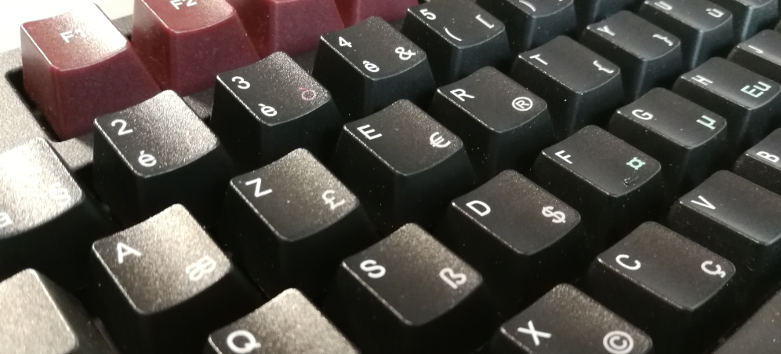

# {{ page.title }}

## Vue d’ensemble

Récemment, l’organisme de certification AFNOR a publié [la norme NF Z71-300](https://www.boutique.afnor.org/norme/nf-z71-300/interfaces-utilisateurs-dispositions-de-clavier-bureautique-francais/article/901594/fa188960) portant sur deux dispositions de claviers bureautiques pour l’écriture du français. Cette norme établit les règles de gravure des claviers physiques ainsi que les caractères qui doivent être pris en charge par les pilotes pour les systèmes d’exploitation concernés.

Parmi les dispositions proposées par la norme, la disposition AZERTY – appelée AZERTY-NF dans la suite – a été repensée pour inclure l’intégralité des caractères nécessaires à l’écriture du français, comme, par exemple les caractères `É`, `œ` et `«`. Elle inclue également de nombreux caractères et signes de ponctuation utilisés dans les langues européennes, y compris les caractères grecs courants.

Pourtant, l’utilisation de cette disposition reste intuitive car 93% des positions sont partagées par la disposition AZERTY « traditionnelle ». Les positions modifiées sont rendues intuitives par un groupement logique de certains caractères, comme les parenthèses, ou les signes mathématiques.

Une documentation rapide de la disposition est disponible [ci-dessous](#usage).

### Libre de droit

- [Essayez la disposition](https://github.com/springcomp/optimized-azerty-win/releases) sous Windows®.
- [Consulter l’aide à l’installation](download.md) pour plus de détails.
- [Faîtes-nous part](https://github.com/springcomp/optimized-azerty-win/issues) de vos commentaires et suggestions d’amélioration.

La disposition AZERTY-NF distribuée sous license [Creative Commons CC-BY](https://creativecommons.org/licenses/by/4.0/) qui vous permet de copier et redistribuer la disposition sur tout support. Elle permet également l’utilisation de la disposition dans un contexte commercial.

Vos contributions sont bienvenues.

### Ressources

Si vous souhaitez changer les touches de votre clavier mécanique, je vous propose un gabarit vectoriel prêt à l’emploi qui vous permettra de créer un jeu de touches personnalisées conforme aux règles de gravure recommandées par la norme. Je m’en suis servi pour mon propre clavier mécanique WASD  et je ne peux que le recommander pour les plus passionnés.

 - [Gabarit vectoriel](https://github.com/springcomp/wasd-iso-104-fr/blob/nf-z71-300/wasd-inkscape-104.88-iso.fr%20%28nf%20z71-300%29.svg) pour le logiciel Inkscape.

## Utilisation

Tout d’abord, la disposition a été pensée pour ne pas trop bouleverser les habitudes des utilisateurs. Vous devriez y trouver tous les caractères nécessaires à la bonne écriture du français. Avec un peu d’habitude, les réflexes reviennent assez vite.

### Majuscules accentuées

L’une des critiques principales vis-à-vis de la disposition AZERTY actuelle est la difficulté de saisir des majuscules accentuées. La disposition AZERTY-NF résoud ce problème en proposant, en accès rapide, sur des positions intuitives, les majuscules suivantes :

|Position|Caractère|
|---|---|
| <kbd>AltGr</kbd>+<kbd>Maj.</kbd>+<kbd>à</kbd> | `À` |
| <kbd>AltGr</kbd>+<kbd>Maj.</kbd>+<kbd>é</kbd> | `É` |
| <kbd>AltGr</kbd>+<kbd>Maj.</kbd>+<kbd>è</kbd> | `È` |
| <kbd>AltGr</kbd>+<kbd>Maj.</kbd>+<kbd>ê</kbd> | `Ê` |
| <kbd>AltGr</kbd>+<kbd>Maj.</kbd>+<kbd>u</kbd> | `Ù` |
| <kbd>AltGr</kbd>+<kbd>Maj.</kbd>+<kbd>c</kbd> | `Ç` |

On trouvera également les deux ligatures courantes du français :

|Position|Caractère|
|---|---|
| <kbd>AltGr</kbd>+<kbd>Maj.</kbd>+<kbd>a</kbd> | `Æ` |
| <kbd>AltGr</kbd>+<kbd>Maj.</kbd>+<kbd>o</kbd> | `Œ` |

### Caractères accentués et signes diacritiques

L’une des particularité de la disposition est d’être résolument moderne et de permettre la saisie d’un très grand nombre de caractères accentués. En plus des accents et diacritiques `accent grave`, `accent circonflexe`, `tréma` et `tilde` que vous connaissez déjà sur votre disposition AZERTY actuelle, la disposition AZERTY-NF supporte un grand nombre d’accents et de diacritiques, moins fréquemment utilisés en France, mais permettant néanmoins la saisie, notamment, de la plupart des langues latines des pays européens.

De manière similaires à la touche <kbd>^</kbd> que vous connaissez, les accents et diacritiques sont saisis via un mécanisme de _touche morte_. C’est à dire que la touche ne produit pas immédiatement un caractère visible. Au contraire, elle permet de modifier le caractère qui est saisi par la suite.

Par exemple, taper le caractère `Ÿ` est maintenant possible, via la combinaison des touches <kbd>¨</kbd>, <kbd>Maj.</kbd>+<kbd>Y</kbd>.

Si, après avoir appuyé sur la touche morte correspondant à un accent ou une marque diacritique, aucune correspondance n’est trouvée pour produire un caractère accentué, le signe diacritique, lui-même, est produit. Cependant, quelques signes diacritiques n’ont pas d’équivalent visuel dit « non combinant ». Dans ce cas, la disposition AZERTY-NF a fait le choix de produire un caractère dont l'aspect visuel rappelle le signe diacritique concerné.

Les accents et diacritiques présents sont référencés dans le tableau ci-dessous. Pour les touches mortes, existant déjà sur la disposition AZERTY traditionnelle, l’ancienne position est rappelée pour référence. De même, figurent dans le tableaux les points de codage Unicode des caractères produits lorsqu’ils ne sont pas combinés avec un autre caractère.

|Position|Diacritique|Ancienne position|Point de codage Unicode|Exemples|
|---|---|--|---|---|
| <kbd>AltGr</kbd>+<kbd>è</kbd>, <kbd>Espace</kbd> | `` ` `` | <kbd>AltGr</kbd>+<kbd>7</kbd>, <kbd>Espace</kbd> | ACCENT GRAVE (U+0060) | `Àà Èè Ìì Ǹǹ Òò Ùù Ẁẁ Ỳỳ` |
| <kbd>^</kbd>, <kbd>Espace</kbd> | `^` |  (touche déplacée) | ACCENT CIRCONFLEXE (U+005E) | `Ââ Ĉĉ Êê Ĝĝ Ĥĥ Îî Ĵĵ Ôô Ŝŝ Ûû Ŷŷ Ẑẑ` |
| <kbd>¨</kbd>, <kbd>Espace</kbd> | `¨` |  (touche déplacée) | TRÉMA (U+00A8) | `Ää Ëë Ḧḧ Ïï Öö ẗ Üü Ẅẅ Ẍẍ Ÿÿ` |
| <kbd>AltGr</kbd>+<kbd>n</kbd>, <kbd>Espace</kbd> | `~` | <kbd>AltGr</kbd>+<kbd>2</kbd>, <kbd>Espace</kbd> | TILDE (U+007E) | `Ãã Ẽẽ Ĩĩ Ññ Õõ Ũũ Ṽṽ Ỹỹ` |
| <kbd>AltGr</kbd>+<kbd>é</kbd>, <kbd>Espace</kbd> | `´` | N/A | ACCENT AIGU (U+00B4) | `Áá Ćć Éé Ǵǵ Íí Ḱḱ Ĺĺ Ḿḿ Ńń Óó Ṕṕ Ŕŕ Śś Úú Ẃẃ Ýý Źź Ǽǽ` |
| <kbd>AltGr</kbd>+<kbd>v</kbd>, <kbd>Espace</kbd> | `¸` | N/A | CÉDILLE (U+00B8) | `Çç Ḑḑ Ȩȩ Ģģ Ḩḩ Ķķ Ļļ Ņņ Ŗŗ Şş Ţţ` |
| <kbd>AltGr</kbd>+<kbd>V</kbd>, <kbd>Espace</kbd> | `˛` | N/A | OGONEK (U+02DB) | `Ąą Ęę Įį Ǫǫ Ųų` |
| <kbd>AltGr</kbd>+<kbd>‘</kbd>, <kbd>Espace</kbd> | `¯` | N/A | MACRON (U+00AF) | `Āā Ēē Ḡḡ Īī Ōō Ūū Ȳȳ Ǣǣ` |
| <kbd>AltGr</kbd>+<kbd>H</kbd>, <kbd>Espace</kbd> | `ˍ` | N/A | MACRON SOUSCRIT (U+02CD) | `Ḇḇ Ḏḏ ẖ Ḵḵ Ḻḻ Ṉṉ Ṟṟ Ṯṯ Ẕẕ` |
| <kbd>AltGr</kbd>+<kbd>"</kbd>, <kbd>Espace</kbd> | `˚` | N/A | ANNEAU EN CHEF (U+02DA) | `Åå Ůů ẘ ẙ` |
| <kbd>AltGr</kbd>+<kbd>^</kbd>, <kbd>Espace</kbd> | `ˇ` | N/A | CARON (U+02C7) | `Ǎǎ Čč Ďď Ěě Ǧǧ Ȟȟ Ǐǐ ǰ Ǩǩ Ľľ Ňň Ǒǒ Řř Šš Ťť Ǔǔ Žž Ǯǯ` |
| <kbd>Maj.</kbd>+<kbd>AltGr</kbd>+<kbd>(</kbd>, <kbd>Espace</kbd> | `˝` | N/A | DOUBLE ACCENT AIGU (U+02DD) | `Őő Űű` |
| <kbd>Maj.</kbd>+<kbd>AltGr</kbd>+<kbd>)</kbd>, <kbd>Espace</kbd> | `˵` | N/A | DOUBLE ACCENT GRAVE (U+02F5)¹ | `Ȁȁ Ȅȅ Ȉȉ Ȍȍ Ȑȑ Ȕȕ` |
| <kbd>AltGr</kbd>+<kbd>i</kbd>, <kbd>Espace</kbd> | `˙` | N/A | POINT EN CHEF (U+02D9) | `Ȧȧ Ḃḃ Ċċ Ḋḋ Ėė Ḟḟ Ġġ Ḣḣ İı`² `Ŀŀ Ṁṁ Ṅṅ Ȯȯ Ṗṗ Ṙṙ Ṡṡ Ṫṫ Ẇẇ Ẋẋ Ẏẏ Żż ẛ` |
| <kbd>AltGr</kbd>+<kbd>I</kbd>, <kbd>Espace</kbd> | `.` | N/A | point souscrit, figuré par le POINT FINAL (U+002E)³ | `Ạạ Ḅḅ Ḍḍ Ẹẹ Ḥḥ Ịị Ḳḳ Ḷḷ Ṃṃ Ṇṇ Ọọ Ṛṛ Ṣṣ Ṭṭ Ụụ Ṿṿ Ẉẉ Ỵỵ Ẓẓ` |
| <kbd>AltGr</kbd>+<kbd>@</kbd>, <kbd>Espace</kbd> | `˘` | N/A | BRÈVE (U+02D8) | `Ăă Ĕĕ Ğğ Ĭĭ Ŏŏ Ŭŭ` |
| <kbd>AltGr</kbd>+<kbd>#</kbd>, <kbd>Espace</kbd> | `°` | N/A | brève inversée, figurée par le SYMBOLE DEGRÉ (U+00B0)⁴ | `Ȃȃ Ȇȇ Ȋȋ Ȏȏ Ȓȓ Ȗȗ` |
| <kbd>AltGr</kbd>+<kbd>k</kbd>, <kbd>Espace</kbd> | `/` | N/A | BARRE OBLIQUE (U+002F) | `Ⱥ Ȼȼ Ɇɇ Łł Øø Ⱦ ẜ` |
| <kbd>AltGr</kbd>+<kbd>b</kbd>, <kbd>Espace</kbd> | `-` | N/A | barre couvrante, figurée par le SIGNE MOINS - TRAIT D’UNION (U+002D)⁵ | `Ƀƀ Ðđ Ǥǥ Ħħ Ɨ Ɉɉ Ƚƚ Ɍɍ Ŧŧ Ʉ Ɏɏ Ƶƶ` |
| <kbd>AltGr</kbd>+<kbd>!</kbd>, <kbd>Espace</kbd> | `,` | N/A | virgule souscrite, figurée par la VIRGULE (U+002C)⁶ | `Șș Țț` |

{: .footnotes}
¹ Le caractère 'DOUBLE ACCENT GRAVE' est placé sur la ligne de texte et non pas au-dessus.  
² Le signe diacritique 'POINT EN CHEF' sert également à saisir la 'LETTRE LATINE I MINUSCULE SANS POINT', courante en Turquie. Ce symbole est également disponible via la couche des caractères européens, accessible via la combinaison <kbd>AltGr</kbd>+<kbd>Eu</kbd>, <kbd>i</kbd>.  
³ Le signe diacritique 'POINT SOUSCRIT' ne possède pas de représentation non combinante. Il est donc remplacé par le 'POINT FINAL' qui en fournit une approximation visuelle lorsqu’il n’est pas associé à un caractère approprié.  
⁴ Le signe diacritique 'BRÈVE INVERSÉE' ne possède pas de réprésentation non combinante. Il est donc remplacé par le 'SYMBOLE DEGRÉ' lorsqu’il n’est pas associé à un caractère approprié.  
⁵ Le signe diacritique 'BARRE COUVRANTE' ne posséde pas de représentation non combinante. Il est donc remplacé par le 'SIGNE MOINS - TRAIT D’UNION' qui en fournit une approximation visuelle lorsqu’il n’est pas associé à un caractère approprié.  
⁶ Le signe diacritique 'VIRGULE SOUSCRITE' ne possède par de représentation non combinante. Il est donc remplacé par la 'VIRGULE' qui en fournit une approximation visuelle lorsqu’il n’est pas associé à un caractère approprié.

La disposition AZERTY-NF diffère de manière subtile de la disposition traditionnelle à laquelle vous êtes habitué. En effet, de nombreuses langues européennes font usage de caractères accentués ou affublés de signes diacritiques qui ne sont pas d’un usage courant en français. Pour supporter la saisie de ces caractères, la disposition AZERTY-NF met également en œuvre un mécanisme de _signes diacritiques combinants_, qui sont appliqués _a posteriori_ au caractère qui les précede dans la saisie de texte.

Un signe diacritique combinant est produit, tout simplement, en répétant l’appui sur la touche morte correspondante.

Par exemple : 

- <kbd>AltGr</kbd>+<kbd>v</kbd>, <kbd>AltGr</kbd>+<kbd>v</kbd> produit une cédille combinante `◌̧` (U+0327).

Veuillez noter que l’utilisation d’un signe diacritique combinant diffère de l’utilisation de la touche morte correspondante. En effet :

- Un signe diacritique combinant doit être tapé __après__ la saisie du caractère de base sur lequel il doit être appliqué, alors que la touche morte qui permet de composer un caractère doit être tapée _avant_ celui-ci.
- L’utilisation d’un signe diacritique combinant __produit un point de codage Unicode supplémentaire__ dans le texte, ce qui permet de « modifier » le caractère de base saisi précédemment. À l’inverse, une touche morte suivie d’un caractère à composer ne produit qu’un seul point de codage Unicode, correspondant à une version [précomposée](https://fr.wikipedia.org/wiki/Caract%C3%A8re_pr%C3%A9compos%C3%A9) du caractère en question.

Par exemple, les combinaisons de touches suivantes produisent toutes les deux la lettre `é`. Pourtant, la séquence de points de codage Unicode produits dans le texte diffère d’un cas à l’autre.

- <kbd>AltGr</kbd>+<kbd>é</kbd>, <kbd>e</kbd> produit `é`, caractère précomposé 'LETTRE LATINE E MINUSCULE ACCENT AIGU' (U+00E9).
- <kbd>e</kbd>, <kbd>AltGr</kbd>+<kbd>é</kbd>, <kbd>AltGr</kbd>+<kbd>é</kbd> produit `é`, résultant de la séquence des points de codage Unicode 'LETTRE LATINE E MINUSCULE' (U+0065) et 'ACCENT AIGU COMBINANT' (U+0301) `e + ◌́` .

Comme expliqué plus haut, il est possible de saisir le signe diacritique non combiné – s’il existe – en faisant suivre la touche morte correspondante de la touche <kbd>Espace</kbd>, selon la correspondance établie dans le tableau qui figure plus haut.

### Verr. Maj.

La disposition AZERTY-NF inclue également le support des majuscules accentuées à l’aide de la touche <kbd>Verr. Maj.</kbd>. Utilisée principalement sur la disposition suisse-alémanique, cette fonctionnalité est également très populaire sur les dispositions alternatives proposées sur le système d’exploitation Linux.

Traditionnellement, la touche <kbd>Verr. Maj.</kbd> agit comme si l’on restait appuyé continuellement sur la touche <kbd>Maj.</kbd> pendant la saisie. Sur la disposition AZERTY traditionnelle, cela signifie qu’après avoir activé la touche <kbd>Verr. Maj.</kbd>, un appui sur la touche <kbd>é</kbd> produit la caractère `1`. Au contraire, la disposition AZERTY-NF vous permet de taper du texte en majuscule, y compris les caractères accentués, lorsque la touche <kbd>Verr. Maj.</kbd> est enclenchée.

Ainsi, en activant <kbd>Verr. Maj.</kbd> et en tapant la séquence <kbd>à</kbd>, <kbd>é</kbd>, <kbd>ê</kbd>, <kbd>è</kbd>, <kbd>^</kbd>, <kbd>i</kbd>, <kbd>^</kbd>, <kbd>o</kbd>, <kbd>ù</kbd>, le texte produit est `ÀÉÊÈÎÔÙ`.

De manière plus réaliste, il est possible d’activer <kbd>Verr. Maj.</kbd> et de taper la séquence <kbd>c</kbd>, <kbd>’</kbd>, <kbd>e</kbd>, <kbd>s</kbd>, <kbd>t</kbd>, <kbd>Espace</kbd>, <kbd>à</kbd>, <kbd>Espace</kbd>, <kbd>d</kbd>, <kbd>i</kbd>, <kbd>r</kbd>, <kbd>e</kbd>, pour produire le texte `C'EST À DIRE`. Remarquez que ni le caractère apostrophe (`’`) ni le caractère accentué (`à`) n’ont nécessité de précaution particulière au moment de la saisie.

### Caractères des langues européennes

La disposition AZERTY-NF expose une couche supplémentaire – accessible via <kbd>AltGr</kbd>+<kbd>Eu</kbd> – sur laquelle on trouve un petit nombre de caractères peu fréquemment utilisés en français, mais utiles pour certaines langues européennes.

Le tableau ci-dessous reprend les caractères disponibles. D’autres signes de ponctuation sont également présents mais ne sont pas affichés dans le tableau ci-après.

|Position|Caractère|Point de codage Unicode|
|---|---|---|
| <kbd>AltGr</kbd>+<kbd>Eu</kbd>, <kbd>a</kbd> | `ª` | INDICATEUR D’ORDRE FÉMININ (U+00AA) |
| <kbd>AltGr</kbd>+<kbd>Eu</kbd>, <kbd>d</kbd> | `ð` | LETTRE LATINE ETH MINUSCULE (U+0000) |
| <kbd>AltGr</kbd>+<kbd>Eu</kbd>, <kbd>D</kbd> | `Ð` | LETTRE LATINE ETH MAJUSCULE (U+00D0) |
| <kbd>AltGr</kbd>+<kbd>Eu</kbd>, <kbd>e</kbd> | `ə` | LETTRE LATINE SCHWA MINUSCULE (U+0259) |
| <kbd>AltGr</kbd>+<kbd>Eu</kbd>, <kbd>E</kbd> | `Ə` | LETTRE LATINE SCHWA MAJUSCULE (U+018F) |
| <kbd>AltGr</kbd>+<kbd>Eu</kbd>, <kbd>g</kbd> | `ŋ` | LETTRE LATINE ENG MINUSCULE (U+014B) |
| <kbd>AltGr</kbd>+<kbd>Eu</kbd>, <kbd>G</kbd> | `Ŋ` | LETTRE LATINE ENG MAJUSCULE (U+014A) |
| <kbd>AltGr</kbd>+<kbd>Eu</kbd>, <kbd>i</kbd> | `ı` | LETTRE LATINE I MINUSCULE SANS POINT (U+0131) |
| <kbd>AltGr</kbd>+<kbd>Eu</kbd>, <kbd>I</kbd> | `İ` | LETTRE LATINE I MAJUSCULE POINT EN CHEF (U+0130) |
| <kbd>AltGr</kbd>+<kbd>Eu</kbd>, <kbd>j</kbd> | `ij` | LIGATURE LATINE IJ MINUSCULE (U+0133) |
| <kbd>AltGr</kbd>+<kbd>Eu</kbd>, <kbd>J</kbd> | `IJ` | LIGATURE LATINE IJ MAJUSCULE (U+0132) |
| <kbd>AltGr</kbd>+<kbd>Eu</kbd>, <kbd>o</kbd> | `º` | INDICATEUR D’ORDRE MASCULIN (U+00BA) |
| <kbd>AltGr</kbd>+<kbd>Eu</kbd>, <kbd>s</kbd> | `ſ` | LETTRE LATINE LONG S (U+017F) |
| <kbd>AltGr</kbd>+<kbd>Eu</kbd>, <kbd>t</kbd> | `þ` | LETTRE LATINE THORN MINUSCULE (U+00FE) |
| <kbd>AltGr</kbd>+<kbd>Eu</kbd>, <kbd>T</kbd> | `Þ` | LETTRE LATINE THORN MAJUSCULE (U+00DE) |

Le caractère `ſ`, 'LETTRE LATINE LONG S' (U+017F) qui figure dans le tableau ci-dessus possède deux variantes avec signe diacritique.

Les combinaisons suivantes sont disponibles :

- <kbd>AltGr</kbd>+<kbd>k</kbd>, <kbd>AltGr</kbd>+<kbd>Eu</kbd> produces `ẜ` 'LETTRE LATINE MINUSCULE LONG S WITH DIAGONAL STROKE' (U+1E9C)
- <kbd>AltGr</kbd>+<kbd>i</kbd>, <kbd>AltGr</kbd>+<kbd>Eu</kbd> produces `ẛ` 'LETTRE LATINE MINUSCULE LONG S WITH DOT ABOVE' (U+1E9B)

## Problèmes connus

Dans certains cas, la disposition AZERTY-NF ne respecte pas complètement tous les points de la norme AFNOR.

### Signes diacritiques ‘souscrits’

La norme recommande qu’un signe diacritique souscrit puisse être accessible directement via la position dévolue à la version ‘en chef’ du signe diacritique, tout simplement par un appui répété de la touche morte correspondante. Par exemple, pour sélectionner le signe diacritique 'MACRON SOUSCRIT', la séquence <kbd>AltGr</kbd>+<kbd>7</kbd>, <kbd>AltGr</kbd>+<kbd>7</kbd> – correspondant au signe diacritique 'MACRON' – pourrait être utilisée.

La disposition AZERTY-NF a cependant fait le choix de sélectionner le signe diacritique combinant correspondant par un appui répété de la touche morte. En conséquence, la sélection d’un signe diacritique ‘souscrit’ n’est malheureusement pas disponible dans ces conditions.

### Caractères indésirables

Une limitation technique liée à l’élaboration de disposition de clavier force une touche morte à produire une caractère visible lorsqu’aucune correspondance n’est trouvée pour la composition d’un caractère suivante la touche morte.

Par exemple, une touche morte, suivie de la touche <kbd>Retour Arr.</kbd> doit forcément produire un caractère.

Il est donc nécessaire de choisir, pour chaque touche morte, un caractère approprié, pour ne pas créer de surprise ou de confusion lors de la saisie.

- Pour la plupart des accents et signes diacritiques, le caractère non combinant correspondant est choisi. Cela permet, d’une part, de conserver le fonctionnement auquel les utilisateurs sont habitués. En outre, cela permet de saisir, particulièrement, le signe 'ACCENT GRAVE' (U+0060), curieusement absent de la norme !
- Pour certains signes qui n’ont pas d’équivalent non combinant, la disposition AZERTY-NF a fait le choix de sélectionner des caractères dont le dessin est une approximation visuelle.
- Pour la sélection des symboles monétaires ou grecs, la norme impose de choisir, respectivement, le caractère 'SYMBOLE DEVISE' (U+00B4) et le 'SIGNE MICRON' (U+00B5).
- Enfin, reste le choix du caractère associé à la sélection des caractères européens. Pour les raisons exposées ci-après, la disposition AZERTY-NF a choisi le caractère `ſ` 'LETTRE LATINE LONG S' (U+01EF).

Comme expliqué dans la section précédente relative aux caractères européens, la 'LETTRE LATINE LONG S' accepte deux variantes affublés des signes diacritiques 'POINT EN CHEF' et 'BARRE OBLIQUE COUVRANTE'. Normalement, la combinaison de touches nécessaires pour obtenir, par exemple, la 'LETTRE LATINE LONG S DIAGONALE COUVRANTE' ferait obtenir deux touches mortes successives <kbd>AltGr</kbd>+<kbd>i</kbd>, <kbd>AltGr</kbd>+<kbd>Eu</kbd>, <kbd>s</kbd>. Pour des raisons de simplicité, ce sont plutôt les séquences mentionnées plus haut qui sont proposées par la disposition AZERTY-NF.

Dans certains cas, si aucun caractère ne correspond à la composition d’un caractère prévue par la norme, il est possible de voir apparaître le caractère associé à la touche morte.